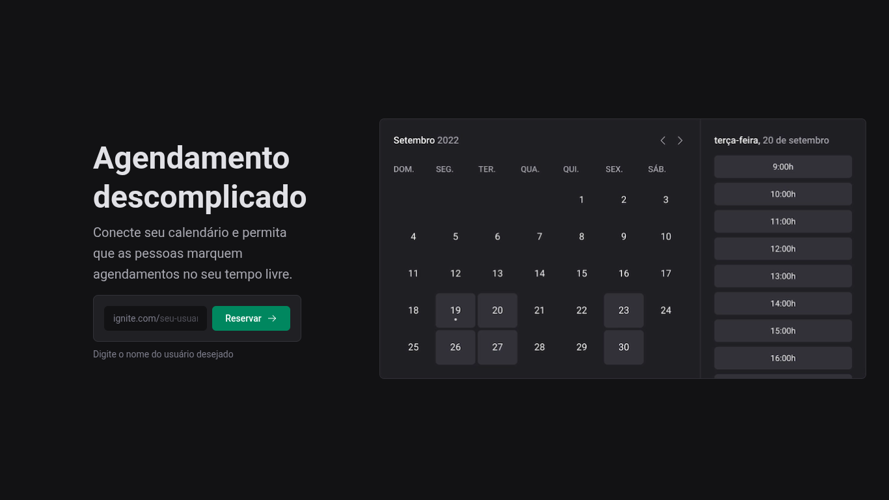

# Ignite Call




Aplicação voltada para barbearias permitindo que as pessoas façam o seu agendamento.

[Sobre a a aplicação](#-sobre-a-aplicação) | [Tecnologias utilizadas](#-tecnologias-utilizadas) | [Layout](#-layout-da-aplicação) | [Como executar a aplicação](#-como-executar-a-aplicação) | [Deploy da aplicação](#-tecnologias-utilizadas) | [Como contribuir](#-como-contribuir) | [Licença](#-licença) | [Autor](#-autor)

## 📄 Sobre a aplicação
A aplicação é voltada para barbearias e permite que as pessoas escolham uma data e um horário no calendário e façam o seu agendamento.

### Features da aplicação
- [x] Cadastro de usuário
- [x] Conexão com calendário
- [x] Configuração de disponibilidade
- [x] Atualização do perfil
- [x] Calendário de disponibilidade
- [x] Agendamento

## 🧑‍💻 Tecnologias utilizadas
[](https://react.dev/)
[](https://nextjs.org/)
[](https://www.prisma.io/)
[](https://tanstack.com/query/latest/docs/framework/react/overview)
[](https://console.cloud.google.com/)
[](https://zod.dev/)
[](https://vercel.com/)

## 🎨 Layout da aplicação
Para acessar o layout da aplicação, você precisará ter uma conta criada no [Figma](https://www.figma.com). 

Caso já tenha uma conta acesse clicando no link abaixo:

- [Layout do Figma](https://www.figma.com/design/7Gt1aTyffcSD4V2PmF2BLK/Ignite-Call-(Community)?node-id=339-74&t=uEOHfIP0DRRtzLxR-1)

## 🚀 Como executar a aplicação

> ### Pré-requisitos:
> 
> É necessário ter instalado em sua máquina o Git e Node (versão LTS).

- Clone esse repositório
```
git clone https://github.com/andersondev96/ignite-call
```
- Acesse a pasta do projeto:
```
cd ignite-call
```
- Instale as dependências
```
npm install
```
- Renomeie o arquivo `.env.example` para `.env` e utilize as suas próprias chaves.
```
cp .env.example .env
```
- Rode o comando para criar as `migrations` do prisma:
```
npx prisma migrate dev
```
- Execute a aplicação:
```
npm run dev
```
- A aplicação será executada na porta `3000`, utilize o *brower* de sua preferência.

## ⚙️ Deploy da aplicação
A aplicação está disponível online nesse [endereço](https://ignite-call-anderson.vercel.app/)

O deploy da aplicação foi feito utilizando o [Vecel](https://vercel.com/)

## 🤝 Como contribuir?
- Faça um *fork* desse repositório.
- Crie uma *branch* com a sua feature: `git checkout -b my-feature`.
- Faça um commit das suas alterações: `git commit -m 'feat: My new feature'`.
- Faça um push para a sua branch: `git clone origin my-feature`.

Depois que o *merge* da sua *pull request* for feito, você poderá deletar a sua *branch*.

## 📝 Licença
Esse projeto está sobre a licensa [MIT](LICENSE)

## 👥 Autor


**Anderson Fernandes Ferreira**

[](https://instagram.com/anderson_ff13)
[](mailto:andersonfferreira96@gmail.com.br)
[](https://www.linkedin.com/in/anderson-fernandes96/)

Feito com 💚 por Anderson Fernandes 👋 [Entre em contato!](https://www.linkedin.com/in/anderson-fernandes96/)


